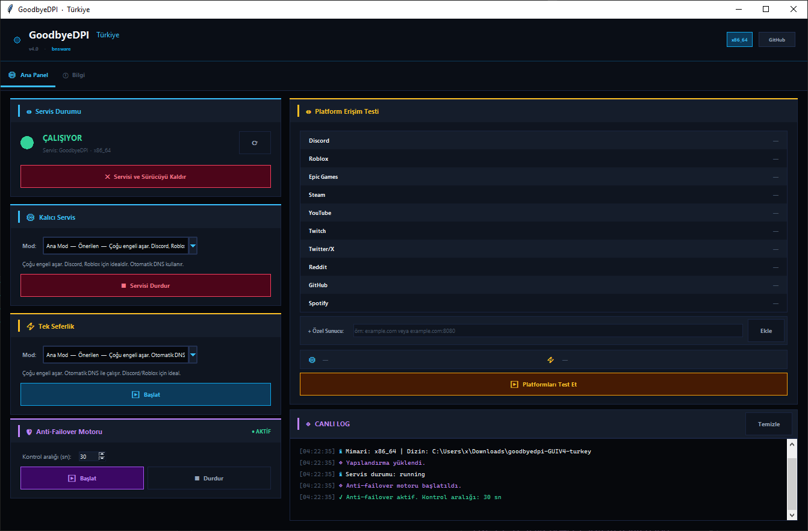

<p align="center">
  
</p>

<h1 align="center">GoodbyeDPI GUI — Türkiye Paketi</h1>

<p align="center">
  <strong>Türkiye ISP'leri tarafından uygulanan DPI engellerini aşmak için geliştirilmiş, modern arayüzlü yönetim paneli.</strong>
</p>

<p align="center">
  <a href="#kurulum"></a>
  <a href="#"></a>
  <a href="#"></a>
  <a href="#lisans"></a>
  <a href="#"></a>
</p>

<p align="center">
  <a href="#özellikler">Özellikler</a> •
  <a href="#kurulum">Kurulum</a> •
  <a href="#kullanım">Kullanım</a> •
  <a href="#modlar">Modlar</a> •
  <a href="#isp-önerileri">ISP Önerileri</a> •
  <a href="#sss">SSS</a> •
  <a href="#katkıda-bulunma">Katkıda Bulunma</a>
</p>

---

## Nedir?

**GoodbyeDPI GUI**, Türkiye'deki internet servis sağlayıcılarının (ISP) uyguladığı **Deep Packet Inspection (DPI)** tabanlı engelleri ve **DNS sansürünü** aşmak için geliştirilen [GoodbyeDPI](https://github.com/ValdikSS/GoodbyeDPI) aracının Türkiye'ye özel yapılandırılmış grafik arayüz (GUI) sürümüdür.

Komut satırı bilgisi gerektirmeden, tek tıkla engelleri aşmanızı sağlar.

---

## Özellikler

### 🎛️ Kalıcı Servis Yönetimi
- Windows servisi olarak kurulum (`sc create`)
- Bilgisayar açıldığında **otomatik başlatma**
- Servis durumu canlı izleme (LED gösterge)
- Tek tıkla başlat / durdur / kaldır

### ⚡ Tek Seferlik Mod
- Servis kurmadan doğrudan `goodbyedpi.exe` çalıştırma
- GUI açık olduğu sürece aktif
- Hızlı test ve deneme için ideal

### 🛡️ Anti-Failover Motoru
- Servis çökme durumunda **otomatik yeniden başlatma**
- Mevcut mod başarısız olursa **alternatif moda otomatik geçiş**
- Yapılandırılabilir kontrol aralığı (3-120 saniye)
- Kesintisiz koruma garantisi

### 🎯 Platform Erişim Testi
- 10 popüler platform için anlık erişim kontrolü:
  - Discord, Roblox, Epic Games, Steam, YouTube
  - Twitch, Twitter/X, Reddit, GitHub, Spotify
- **Özel sunucu ekleme** desteği
- Test sonuçlarına göre **otomatik mod önerisi** (kalıcı ve tek seferlik ayrı ayrı)

### 📋 Canlı Log Paneli
- Tüm işlemler **zaman damgalı** ve **renk kodlu** olarak gösterilir
- Bilgi, başarı, hata, uyarı ve sistem mesajları ayrı renklerle
- Temizlenebilir log geçmişi

### 🎨 Modern Arayüz
- Koyu tema (midnight blue) tasarım
- Cyan, yeşil, kırmızı, amber, mor renk paleti
- Kart tabanlı bölüm yapısı
- Animasyonlu durum göstergeleri
- Sekme sistemi (Ana Panel + Bilgi)

### 🔧 Ek Özellikler
- x86 ve x86_64 **otomatik mimari algılama**
- Yapılandırma otomatik kaydetme/yükleme (`gui_config.json`)
- Yönetici yetkisi olmadan çalıştırıldığında **otomatik UAC yükseltme**
- Hata durumunda detaylı log dosyası (`gui_hata.txt`)

---

## Kurulum

### Gereksinimler

| Gereksinim | Minimum Versiyon | Açıklama |
|:---|:---|:---|
| **İşletim Sistemi** | Windows 7+ | Windows 7, 8, 8.1, 10, 11 |
| **Python** | 3.8+ | Tkinter dahil (standart kütüphane) |
| **Yetki** | Yönetici | Servis işlemleri için gerekli |

### Adım Adım Kurulum

**1.** Repoyu klonlayın:
```bash
git clone https://github.com/bnsware/GoodByeDPIManager.git
cd GoodByeDPIManager
```

**2.** Uygulamayı başlatın:

**Yöntem A** — Batch dosyası ile:
```
ÇALIŞTIR.bat
```
> Çift tıklayarak çalıştırın. Otomatik olarak yönetici yetkisi isteyecektir.

**Yöntem B** — Python ile:
```bash
python gui.py
```
> Yönetici olarak çalıştırmanız gerekir. Program kendisi UAC penceresi açacaktır.

> **Not:** Harici kütüphane kurulumu gerekmez. Tüm bağımlılıklar Python standart kütüphanesindedir.

---

## Kullanım

### Hızlı Başlangıç

```
1. ÇALIŞTIR.bat dosyasını çift tıklayın
2. UAC penceresinde "Evet" deyin
3. "Kalıcı Servis" bölümünde "Ana Mod — Önerilen" seçili olduğundan emin olun
4. "Servisi Yükle ve Başlat" butonuna tıklayın
5. Durum göstergesinin yeşile (ÇALIŞIYOR) döndüğünü doğrulayın
```

### Çalışma Modları

| Mod | Açıklama | Ne Zaman Kullanılır |
|:---|:---|:---|
| **Kalıcı Servis** | Windows servisi olarak yüklenir, bilgisayar açıldığında otomatik başlar | Sürekli koruma istiyorsanız |
| **Tek Seferlik** | GUI açık olduğu sürece çalışır, servis yüklemez | Test etmek veya geçici kullanım için |

### Arayüz Rehberi

| Bölüm | İşlev |
|:---|:---|
| **Servis Durumu** | Mevcut servisin çalışıp çalışmadığını gösterir (LED + metin) |
| **Kalıcı Servis** | Mod seçimi + servis yükleme/başlatma/durdurma |
| **Tek Seferlik** | Mod seçimi + anlık başlatma/durdurma |
| **Anti-Failover Motoru** | Otomatik kurtarma sistemini başlatma/durdurma |
| **Platform Erişim Testi** | Platform erişim kontrolü + mod önerisi |
| **Canlı Log** | Tüm işlemlerin gerçek zamanlı kaydı |

---

## Modlar

### Mod Detayları

| # | Mod Adı | Argümanlar | DNS | Açıklama |
|:---:|:---|:---|:---:|:---|
| 0 | **Ana Mod — Önerilen** | `-5 --set-ttl 5 --dns-addr 77.88.8.8 --dns-port 1253` | Otomatik | Çoğu ISP için en iyi başlangıç. Discord, Roblox için ideal. |
| 1 | **Alternatif 1 — Hafif Bypass** | `--set-ttl 3` | Manuel | Yalnızca TTL manipülasyonu. Hafif ve hızlı. |
| 2 | **Alternatif 2 — SNI Bypass** | `-5` | Manuel | Paket imzasını gizler. |
| 3 | **Alternatif 3 — TTL + DNS** | `--set-ttl 3 --dns-addr 77.88.8.8 --dns-port 1253` | Otomatik | TTL + Yandex DNS kombinasyonu. Discord için etkili. |
| 4 | **Alternatif 4 — Epic/Steam** | `-5 --dns-addr 77.88.8.8 --dns-port 1253` | Otomatik | SNI bypass + Yandex DNS. Epic Games ve Steam için. |
| 5 | **Alternatif 5 — TTNet/YouTube** | `-9 --dns-addr 77.88.8.8 --dns-port 1253` | Otomatik | Güçlü bypass + Yandex DNS. TTNet ve YouTube için. |
| 6 | **Alternatif 6 — Güçlü Bypass** | `-9` | Manuel | En agresif mod. |

### Mod Seçim Rehberi

```
Başlangıç → Ana Mod (0)
    ├── Çalışıyor mu? → ✓ Devam edin
    └── Çalışmıyor mu?
        ├── Discord/Roblox sorunu → Alternatif 3
        ├── Epic/Steam sorunu → Alternatif 4
        ├── YouTube/TTNet sorunu → Alternatif 5
        └── Hiçbiri çalışmıyor → Alternatif 6 + Manuel DNS
```

> **İpucu:** Hangi modun sizin için en iyi çalıştığından emin değilseniz, **Platform Erişim Testi** özelliğini kullanın. Sistem otomatik olarak en uygun modu önerecektir.

---

## ISP Önerileri

| ISP | Önerilen Mod | Notlar |
|:---|:---|:---|
| **TTNet / Türk Telekom** | Alternatif 5 veya Ana Mod | `-9` modu genellikle daha iyi çalışır |
| **Superonline** | Alternatif 4 | DNS port değişikliği gerekebilir |
| **Vodafone** | Ana Mod veya Alternatif 3 | Standart yapılandırma yeterli |
| **Türkcell Fiber** | Ana Mod | Sorun yaşanırsa Alternatif 5 deneyin |

---

## Proje Yapısı

```
goodbyedpi-GUIV4-turkey/
├── gui.py                                          # Ana uygulama (GUI + tüm iş mantığı)
├── gui_config.json                                 # Kullanıcı yapılandırması (otomatik oluşturulur)
├── ÇALIŞTIR.bat                                    # Hızlı başlatıcı
│
├── x86_64/                                         # 64-bit bileşenler
│   ├── goodbyedpi.exe                              # Ana DPI bypass motoru
│   ├── WinDivert.dll                               # Paket yakalama kütüphanesi
│   └── WinDivert64.sys                             # Çekirdek sürücüsü
│
├── x86/                                            # 32-bit bileşenler
│   ├── goodbyedpi.exe
│   ├── WinDivert.dll
│   ├── WinDivert32.sys
│   └── WinDivert64.sys
│
├── turkey_dnsredir.cmd                             # CLI: Ana mod
├── turkey_dnsredir_alternative_superonline.cmd     # CLI: Superonline alternatifleri
├── turkey_dnsredir_alternative2_superonline.cmd
├── turkey_dnsredir_alternative3_superonline.cmd
├── turkey_dnsredir_alternative4_superonline.cmd
├── turkey_dnsredir_alternative5_superonline.cmd
├── turkey_dnsredir_alternative6_superonline.cmd
│
├── service_install_dnsredir_turkey.cmd             # Servis kurulum scriptleri
├── service_install_dnsredir_turkey_alternative_superonline.cmd
├── service_install_dnsredir_turkey_alternative2_superonline.cmd
├── service_install_dnsredir_turkey_alternative3_superonline.cmd
├── service_install_dnsredir_turkey_alternative4_superonline.cmd
├── service_install_dnsredir_turkey_alternative5_superonline.cmd
├── service_install_dnsredir_turkey_alternative6_superonline.cmd
│
├── service_remove.cmd                              # Servis kaldırma scripti
│
├── licenses/                                       # Lisans dosyaları
│   ├── LICENSE-goodbyedpi.txt
│   ├── LICENSE-windivert.txt
│   ├── LICENSE-getline.txt
│   └── LICENSE-uthash.txt
│
├── assets/                                         # Görseller
│   └── screenshot.png
│
├── .gitignore
└── README.md
```

---

## Teknik Detaylar

### Nasıl Çalışır?

```
Kullanıcı → GUI (Python/Tkinter) → Windows SC Komutu → GoodbyeDPI Servisi
                                                              │
                                                              ▼
                                                     WinDivert Sürücüsü
                                                              │
                                                              ▼
                                                  Ağ Paketleri Manipülasyonu
                                                     (TTL, SNI, DNS)
```

1. **GUI** kullanıcı tercihlerini alır ve `sc` (Service Control) komutları ile Windows servis yönetimini gerçekleştirir
2. **GoodbyeDPI** bir Windows servisi olarak çalışarak ağ trafiğini WinDivert üzerinden yakalar
3. **WinDivert** çekirdek seviyesinde paket yakalama ve manipülasyon sağlar
4. DPI engelleri **TTL manipülasyonu**, **SNI gizleme** ve **DNS yönlendirme** teknikleri ile aşılır

### Kullanılan Teknolojiler

| Teknoloji | Kullanım Alanı |
|:---|:---|
| **Python 3 + Tkinter** | Grafik arayüz |
| **GoodbyeDPI** | DPI bypass motoru |
| **WinDivert** | Windows paket yakalama sürücüsü |
| **Windows SC** | Servis yönetimi |
| **Yandex DNS** | Alternatif DNS çözümleme (77.88.8.8:1253) |

### Anti-Failover Sistemi

Anti-failover motoru arka planda sürekli çalışarak servis sağlığını izler:

```
Kontrol Döngüsü (varsayılan: 5sn)
    │
    ├── Servis çalışıyor → Hata sayacı sıfırla → Devam
    │
    └── Servis yanıt vermiyor
        ├── Hata sayacı < 3 → Uyarı logla → Tekrar kontrol
        └── Hata sayacı ≥ 3 → FAILOVER
            ├── Mevcut servisi durdur ve sil
            ├── Sonraki moda geç (döngüsel)
            ├── Yeni servisi oluştur ve başlat
            └── Başarılı? → Hata sayacı sıfırla
```

---

## CMD Scriptleri (GUI Alternatifi)

GUI kullanmak istemeyenler için hazır CMD scriptleri mevcuttur:

### Tek Seferlik Çalıştırma
```cmd
turkey_dnsredir.cmd
```
> Ana modu çalıştırır. CMD penceresi açık kaldığı sürece aktif kalır.

### Windows Servisi Olarak Kurulum
```cmd
service_install_dnsredir_turkey.cmd
```
> Sağ tık → **Yönetici olarak çalıştır**. Servis otomatik başlatma ile kurulur.

### Servis Kaldırma
```cmd
service_remove.cmd
```
> GoodbyeDPI ve WinDivert servislerini tamamen kaldırır.

---

## SSS

<details>
<summary><strong>Windows Defender virüs uyarısı veriyor, ne yapmalıyım?</strong></summary>
<br>
Bu bir <strong>false positive</strong> (yanlış alarm) durumudur. GoodbyeDPI ve WinDivert, ağ paketlerini manipüle ettikleri için bazı antivirüs yazılımları tarafından şüpheli olarak işaretlenebilir. Proje açık kaynaklıdır ve kaynak kodu incelenebilir. Programı güvenlik yazılımınızın istisnalar listesine ekleyebilirsiniz.
</details>

<details>
<summary><strong>"Yönetici yetkisi yok" uyarısı alıyorum</strong></summary>
<br>
GoodbyeDPI servis işlemleri için yönetici (Administrator) yetkisi gereklidir. Program otomatik olarak UAC penceresi açar. Eğer açılmıyorsa, <code>ÇALIŞTIR.bat</code> dosyasına sağ tıklayıp <strong>"Yönetici olarak çalıştır"</strong> seçeneğini kullanın.
</details>

<details>
<summary><strong>Ana mod çalışmıyor, ne yapmalıyım?</strong></summary>
<br>
<ol>
  <li><strong>Platform Erişim Testi</strong> yapın — sistem otomatik mod önerecektir</li>
  <li>ISP'nize uygun <a href="#isp-önerileri">alternatif modu</a> deneyin</li>
  <li>Manuel DNS değişikliği gerektiren modlarda Windows DNS ayarlarınızı güncelleyin</li>
  <li>Alternatif 5 (-9 + DNS) veya Alternatif 6 (-9) deneyin</li>
</ol>
</details>

<details>
<summary><strong>Manuel DNS nasıl değiştirilir?</strong></summary>
<br>
<ol>
  <li>Denetim Masası → Ağ ve Paylaşım Merkezi → Adaptör ayarlarını değiştir</li>
  <li>Aktif ağ bağlantısına sağ tık → Özellikler</li>
  <li>Internet Protocol Version 4 (TCP/IPv4) → Özellikler</li>
  <li>Aşağıdaki DNS sunucu adreslerini kullan:
    <ul>
      <li>Tercih edilen: <code>1.1.1.1</code> (Cloudflare) veya <code>8.8.8.8</code> (Google)</li>
      <li>Alternatif: <code>1.0.0.1</code> veya <code>8.8.4.4</code></li>
    </ul>
  </li>
</ol>
</details>

<details>
<summary><strong>Servis kaldırılamıyor, hata alıyorum</strong></summary>
<br>
Yönetici yetkili bir PowerShell veya CMD açarak aşağıdaki komutları sırasıyla çalıştırın:
<pre>
sc stop GoodbyeDPI
sc delete GoodbyeDPI
sc stop WinDivert
sc delete WinDivert
sc stop WinDivert14
sc delete WinDivert14
</pre>
</details>

<details>
<summary><strong>Python yüklü değilse ne yapabilirim?</strong></summary>
<br>
<a href="https://www.python.org/downloads/">Python'u indirin</a> ve kurulum sırasında <strong>"Add Python to PATH"</strong> seçeneğini işaretleyin. Python 3.8 ve üzeri herhangi bir sürüm yeterlidir. Tkinter, Python ile birlikte gelir.
</details>

---

## Katkıda Bulunma

Katkılarınızı memnuniyetle karşılarız! İşte katkıda bulunmanın yolları:

1. **Hata Bildirimi:** [Issues](../../issues) bölümünden hata bildirebilirsiniz
2. **Özellik Önerisi:** Yeni özellik fikirlerinizi paylaşabilirsiniz
3. **Pull Request:** Kod katkıları için PR açabilirsiniz

### PR Açarken

```bash
# Repoyu fork edin ve klonlayın
git clone https://github.com/KULLANICI_ADINIZ/goodbyedpi-GUIV4-turkey.git

# Yeni bir branch oluşturun
git checkout -b ozellik/yeni-ozellik

# Değişikliklerinizi commit edin
git commit -m "Yeni özellik: açıklama"

# Push edin ve PR açın
git push origin ozellik/yeni-ozellik
```

---

## Yasal Uyarı

> **⚠️ Bu araç yalnızca eğitim ve araştırma amaçlıdır.**
>
> Kullanımdan doğan tüm sorumluluk kullanıcıya aittir. Lütfen bulunduğunuz ülkenin yasalarına uygun hareket edin. Bu yazılım herhangi bir yasa dışı faaliyeti teşvik etmez.

---

## Lisans

Bu proje birden fazla açık kaynak bileşen içermektedir:

| Bileşen | Lisans |
|:---|:---|
| **GoodbyeDPI** | Apache License 2.0 |
| **WinDivert** | GNU Lesser General Public License v3 |
| **getline** | MIT License |
| **uthash** | BSD License |

Detaylar için [`licenses/`](licenses/) klasörüne bakınız.

---

## Teşekkürler

- [ValdikSS](https://github.com/ValdikSS) — GoodbyeDPI'ın orijinal geliştiricisi
- [basil00](https://github.com/basil00) — WinDivert kütüphanesinin geliştiricisi
- Türkiye kullanıcı topluluğu — Test ve geri bildirimler için

---

<p align="center">
  <sub>
    <strong>GoodbyeDPI GUI v4.0 — Türkiye Paketi</strong>
    <br>
    Geliştirici: <a href="https://github.com/bnsware">bnsware</a>
  </sub>
</p>
